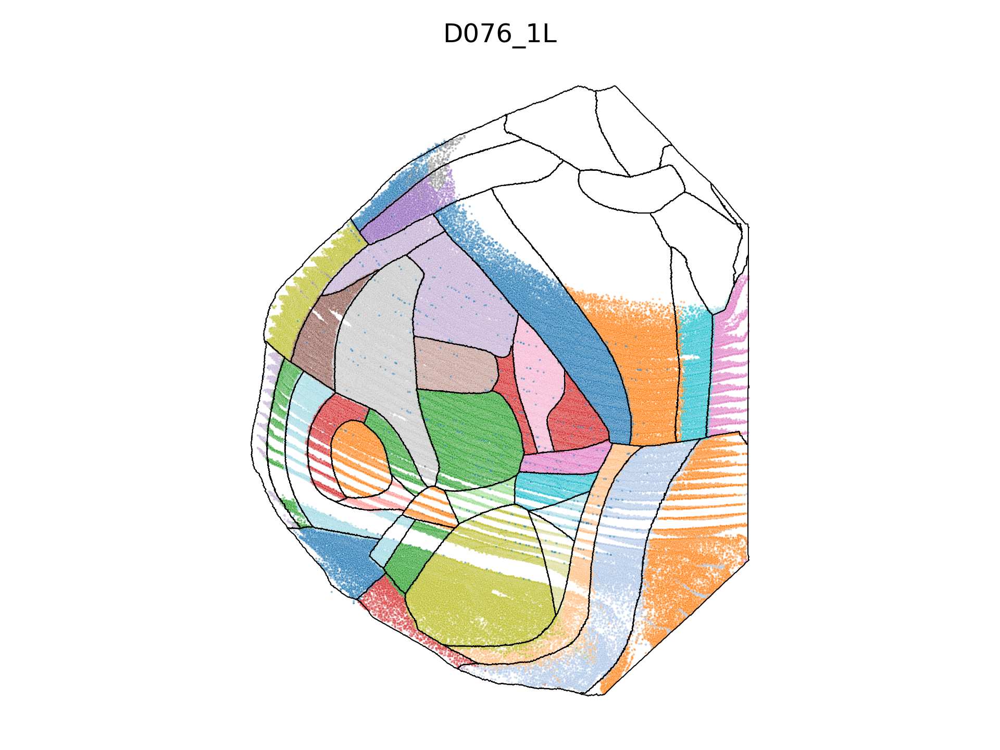
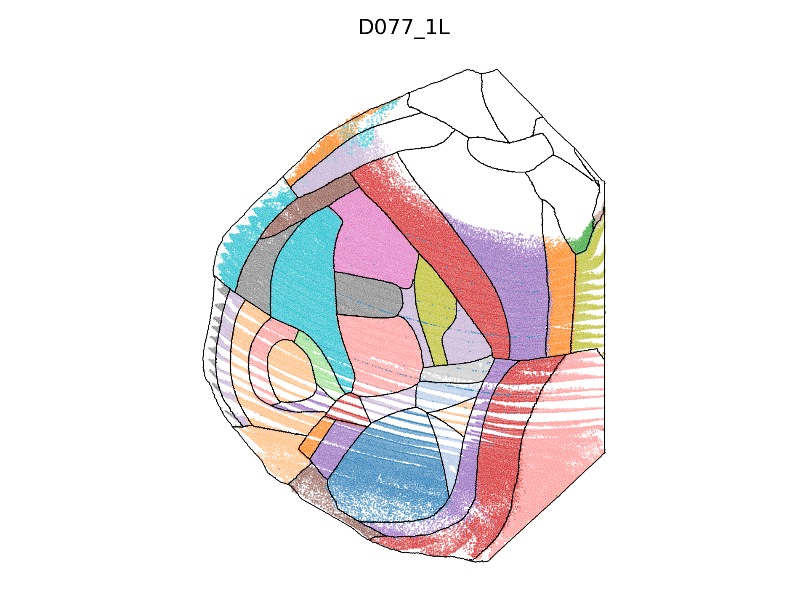
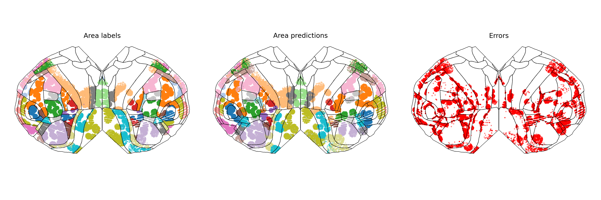

## Single-cell predictions

### Area classification is much easier for some cell types

Although the average accuracy of area predictions for single cells is about 30%, not all cells are equally easy to spatially locate. Some cell types are much easier than others.

This can be seen by stratifying the accuracy by `h2_type`:

The finest level of types (H3) shows even greater heterogeneity.

#### Not surprising given distributions of cells.

This result shouldn't surprise us much, as some cell types are highly localized in the cortex to a particular area:

#### Why does pooling improve? Controlling for cell type

Pooling improves predictions in part because cells contain independent information (i.e. because of noise), and also because of cell heterogeneity. We can correct for the latter by controlling for cell type to see how much of the improvement is due to noise.

## Brains have different spatial coverage

The spatial coverage of the brain is not uniform across brains. Some brains have more cells in some areas than others:

## Improving the model

#### Also predicting the locations of each cell

On Tingkai's suggestions, we can additionally try to predict the location of *each* cell, as well as the location of the overall area. 
This might add more information, as we're adding some noise in by selecting the mode of the area annotation.

This doesn't seem to help the overall classification problem much:

However, it does allow us to predict the area of each cell in the group separately:

#### Using relative location within the group

We also have access to the spatial distribution of cells within the subselected group. We can use this information to perhaps predict the location of the group better.

Interestingly, this doesn't help too much. Even when using the *absolute* Z position (which is obscured in relative coordinates because we often sample from oblique planes),
we don't see much of an improvement. 

We do however see a modest improvement when using the absolute Z position for the task of single-cell area prediction:

#### Also including Ahmed's approach doesn't help

We learned that averaging the single-cell logits works surprisingly well. What if we include these and average the overall predictions? I found that this uniformly hurts the model.

## Correcting for the imbalance in area frequencies

In many circumstances we wish to annotate a new brain without using the prior likelihoods that some areas are bigger than others. This produces an artifician expanding of the annotated areas. 

Let's look at the validation set predictions with and without correcting for the area frequencies. First, here are the predictions without correction for a group size of 32:

And here are the predictions with class balancing (note: colors have changed):

Accuracy for the balanced model fell only to 72.84% from 73.33%.

### Predicted locations of single cells

When we also train towards the locations of single cells, we can also plot the predicted area of each single cell within the cells selected in the validation set. Here for groups of 256 cells:

Couple interesting things to note here.
 - Even though validation cells are uniformly distributed, the sampling procedure (choose a centroid point, select closest 256 cells, terminate at `len(dataset)//group_size` centroids) never evaluates many validation cells. Others are sampled multiple times.
 - The model is NOT able to learn boundaries that cut through groups. Makes sense; it's encouraged by our dual loss function...
 - Begs the question: what if we just train on the single-cell labels?